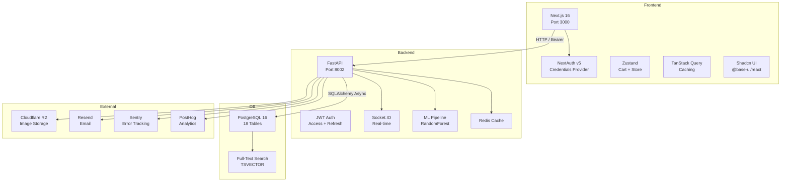

# KhataBox — B2B Retail Management Platform

KhataBox is a full-stack B2B retail management platform for Indian small-to-medium businesses. It enables shopkeepers to manage inventory, customers, orders, suppliers, and stores from a single dashboard. Customers can browse a product catalog, scan QR codes, place bulk orders with credit limits, and track their order history.

## Problem Statement

Small Indian retailers (kirana stores, pharmacies, electronics shops) lack affordable digital tools to manage their supply chain, customer relationships, and inventory across multiple store locations. Existing solutions are either too expensive, too complex, or do not support Indian business requirements like GST, credit-based B2B ordering, and multi-store operations.

## Solution

KhataBox provides a web-based platform with role-based access for admins, shopkeepers, and customers. It offers real-time inventory tracking, order lifecycle management, supplier price analysis, ML-based demand forecasting, QR code product labeling, receipt generation, and bulk data export/import. The system is built with modern technologies (Next.js 16, FastAPI, PostgreSQL) and designed for production deployment on Railway and Vercel.

<!--  -->
<!--  -->
<!--  -->
<!--  -->

## Architecture



## Tech Stack

| Layer | Technology | Version |
|-------|-----------|---------|
| Frontend Framework | Next.js (App Router) | 16.2.7 |
| UI Library | React | 19.2.4 |
| Styling | Tailwind CSS | v4 |
| Component Library | Shadcn UI (on @base-ui/react) | 1.5.0 |
| State Management | Zustand | 5.0.14 |
| Server State | TanStack Query | 5.101.0 |
| Auth (Frontend) | NextAuth | v5 (beta.31) |
| Charts | Recharts | 3.8.1 |
| Backend Framework | FastAPI | 0.115.6 |
| ORM | SQLAlchemy (async) | 2.0.50 |
| Validation | Pydantic | 2.13.4 |
| Auth (Backend) | python-jose + passlib (bcrypt) | — |
| Database | PostgreSQL | 16 |
| Cache / Queue | Redis | 7 |
| ML | scikit-learn (RandomForest) | 1.9.0 |
| QR Code | qrcode + Pillow | 8.2 / 12.2 |
| PDF Generation | ReportLab | 4.5.1 |
| Spreadsheet | openpyxl | 3.1.5 |
| Real-time | python-socketio / socket.io-client | 5.11.0 / 4.8.3 |
| File Storage | Cloudflare R2 (S3-compatible) | — |
| Email | Resend | — |
| Error Tracking | Sentry | — |
| Analytics | PostHog | — |
| Deployment (Backend) | Railway (Docker) | — |
| Deployment (Frontend) | Vercel | — |

## Folder Structure

```
KhataBox/
├── src/                # Next.js frontend
│   ├── app/            # App Router pages + layouts
│   │   ├── (dashboard)/  # Admin/shopkeeper routes (20 pages)
│   │   ├── (customer)/   # Customer route group (empty placeholders)
│   │   ├── api/auth/     # NextAuth route handler
│   │   ├── cart/         # Cart page
│   │   ├── catalog/      # Public catalog page
│   │   ├── customer/     # Customer landing page
│   │   ├── login/        # Login page
│   │   ├── my-orders/    # Customer order history
│   │   ├── receipts/     # Receipt view
│   │   ├── register/     # Registration page
│   │   └── scan/         # QR scanner page
│   ├── components/     # Reusable components
│   │   ├── ui/         # Shadcn primitives (15 files)
│   │   ├── layout/     # Sidebar, top-nav, bottom-nav
│   │   ├── auth/       # RoleGuard + useRole
│   │   ├── customers/  # Customer cart components
│   │   └── products/   # Product form dialogs
│   ├── lib/            # API clients, auth config, utils
│   ├── store/          # Zustand stores (cart, customer-cart)
│   ├── types/          # TypeScript interfaces (7 files)
│   └── test/           # Vitest unit tests (5 files)
├── backend/            # FastAPI backend
│   ├── app/
│   │   ├── api/v1/     # 22 route modules
│   │   ├── core/       # Database, security, dependencies
│   │   ├── ml/         # model.pkl, predict.py, train.py
│   │   ├── models/     # 18 SQLAlchemy model tables
│   │   ├── schemas/    # 11 Pydantic schema files
│   │   ├── services/   # 10 service modules
│   │   ├── config.py   # Pydantic settings
│   │   └── main.py     # FastAPI app entrypoint
│   ├── alembic/        # 12 database migrations
│   ├── tests/          # 3 test files (39+ endpoint tests)
│   └── seed_india.py   # Demo data seeder
├── config/             # .env.example files
├── docs/               # Documentation
└── scripts/            # Start/stop scripts
```

## Installation

### Prerequisites

- Node.js 20+
- Python 3.11+
- Docker Desktop (for PostgreSQL + Redis)
- npm

### Setup

```bash
# Clone the repository
git clone <repo-url> && cd KhataBox

# Install frontend dependencies
npm install

# Install backend dependencies
cd backend
pip install -r requirements.txt
cd ..

# Start database services
docker compose up -d

# Run database migrations
cd backend
alembic upgrade head

# Seed demo data
python seed_india.py
cd ..
```

## Configuration

### Backend (`backend/.env`)

| Variable | Required | Default | Description |
|----------|----------|---------|-------------|
| `DATABASE_URL` | Yes | — | PostgreSQL async connection string |
| `SECRET_KEY` | Yes | change-me | JWT signing secret |
| `ALGORITHM` | No | HS256 | JWT algorithm |
| `ACCESS_TOKEN_EXPIRE_MINUTES` | No | 30 | Access token TTL |
| `REFRESH_TOKEN_EXPIRE_DAYS` | No | 7 | Refresh token TTL |
| `REDIS_URL` | No | — | Redis connection string |
| `RESEND_API_KEY` | No | — | Resend transactional email key |
| `SENTRY_DSN` | No | — | Sentry error tracking DSN |
| `POSTHOG_API_KEY` | No | — | PostHog analytics key |
| `POSTHOG_HOST` | No | https://us.i.posthog.com | PostHog host |
| `CORS_ORIGINS` | Yes | http://localhost:3000 | Comma-separated allowed origins |
| `R2_ENDPOINT_URL` | No | — | Cloudflare R2 S3 endpoint |
| `R2_ACCESS_KEY_ID` | No | — | R2 access key |
| `R2_SECRET_ACCESS_KEY` | No | — | R2 secret key |
| `R2_BUCKET_NAME` | No | khatabox | R2 bucket name |
| `R2_PUBLIC_URL` | No | — | R2 public bucket URL |

### Frontend (`.env.local`)

| Variable | Required | Description |
|----------|----------|-------------|
| `NEXT_PUBLIC_API_URL` | Yes | Backend API URL (default: http://localhost:8000) |
| `AUTH_SECRET` | Yes | NextAuth JWT encryption secret |
| `AUTH_URL` | Yes | Frontend public URL |

## Running Locally

```bash
# Start backend (from project root)
cd backend
uvicorn app.main:app --reload --host 0.0.0.0 --port 8002

# Start frontend (from project root, in another terminal)
cd frontend
npm run dev
```

- Frontend: http://localhost:3000
- API docs: http://localhost:8002/docs
- Health check: http://localhost:8002/health

## Deployment

### Backend (Railway)

The backend is deployed via Docker. The included `Dockerfile` runs the FastAPI app with Uvicorn. Railway auto-detects the Dockerfile. Set the health check path to `/health`.

### Frontend (Vercel)

The frontend is deployed from the repository root. Vercel auto-detects Next.js. Set the environment variables `NEXT_PUBLIC_API_URL`, `AUTH_SECRET`, and `AUTH_URL`.

## Authentication Flow

1. User submits credentials on the login page (role selected: admin/shopkeeper/customer).
2. NextAuth `authorize` callback sends a POST to `/api/v1/auth/login` on the FastAPI backend.
3. Backend validates credentials, returns JWT access token (30 min) and refresh token (7 days).
4. NextAuth stores tokens in the JWT session strategy.
5. Subsequent API calls use `client-api.ts` which attaches the access token as a Bearer header.
6. Backend `get_current_user` dependency decodes the JWT and loads the user from the database.
7. `require_role` dependency enforces role-based access at the endpoint level.

## API Summary

The backend exposes 22 route modules under `/api/v1/`:

| Module | Prefix | Auth | Roles |
|--------|--------|------|-------|
| Authentication | `/auth` | Public + JWT | all |
| Dashboard | `/dashboard` | JWT | admin, shopkeeper |
| Catalog | `/catalog` | JWT | all |
| Products | `/products` | JWT | admin, shopkeeper |
| Orders | `/orders` | JWT | admin, shopkeeper, customer |
| Suppliers | `/suppliers` | JWT | admin, shopkeeper |
| Customers | `/customers` | JWT | admin, shopkeeper |
| Forecasting | `/forecasting` | JWT | admin, shopkeeper |
| Inventory | `/inventory` | JWT | admin, shopkeeper |
| Invoices | `/invoices` | JWT | admin, shopkeeper |
| Receipts | `/receipts` | JWT | admin, shopkeeper |
| Purchase Orders | `/purchase-orders` | JWT | admin, shopkeeper |
| QR Codes | `/qrcodes` | JWT | admin, shopkeeper |
| Expiry | `/expiry` | JWT | admin, shopkeeper |
| Audit | `/audit` | JWT | admin |
| Notifications | `/notifications` | JWT | all |
| Reports | `/reports` | JWT | admin, shopkeeper |
| Stores | `/stores` | JWT | admin, shopkeeper |
| Stock Transfers | `/transfers` | JWT | admin, shopkeeper |
| Customer Cart | `/cart` | JWT | customer |
| Data Management | `/data` | JWT | admin |

## Major Features

- Multi-tenant architecture (admin owns all, shopkeeper owns store data)
- Role-based access control (admin, shopkeeper, customer)
- Multi-store inventory management with stock transfers
- B2B customer management (credit limits, GST, price tiers)
- Order lifecycle: Pending -> Confirmed (reserve stock) -> Processing -> Completed (consume stock) -> Cancelled (release stock)
- Inventory reservation system
- QR code product labeling with batch printing
- ML-based demand forecasting (scikit-learn RandomForest)
- Expiry tracking for batch-managed products
- Full-text search on products (PostgreSQL TSVECTOR + GIN index)
- Real-time notifications via Socket.IO
- PDF invoice and receipt generation (ReportLab)
- Supplier price margin analysis
- Audit logging for all entity changes
- Bulk data export (XLSX) and import (CSV/XLSX)
- Cloud backup and restore via Cloudflare R2

## Role-Based Access Control

| Feature | Admin | Shopkeeper | Customer |
|---------|-------|------------|----------|
| Dashboard | Yes | Yes | No |
| Products CRUD | Yes | Yes | No |
| Catalog (browse) | Yes | Yes | Yes |
| Orders (manage) | Yes | Yes | No |
| My Orders | Yes | Yes | Yes |
| Bulk Orders | Yes | Yes | Yes |
| Suppliers | Yes | Yes | No |
| Customers CRUD | Yes | Yes | No |
| Purchase Orders | Yes | Yes | No |
| Stock Transfers | Yes | Yes | No |
| Forecasting | Yes | Yes | No |
| Reports | Yes | Yes | No |
| Notifications | Yes | Yes | Yes |
| Admin User Mgmt | Yes | No | No |
| Stores CRUD | Yes | Yes | No |
| Data Export/Import | Yes | No | No |
| QR Labels | Yes | Yes | No |
| Settings | Yes | Yes | No |

## ML Features

The ML pipeline in `backend/app/ml/` uses scikit-learn's RandomForestRegressor trained on synthetic data. It predicts demand for a product based on product ID, category, day of week, month, and holiday status. The pre-trained model (`model.pkl`) is loaded by `predict.py`. If the model file is unavailable, the forecast endpoint falls back to a heuristic based on historical sales.

- Training script: `train.py` (generates 2000 synthetic samples, trains RandomForest)
- Prediction: `predict.py` (predict_demand, is_model_ready)
- API: `GET /api/v1/forecasting/demand/{product_id}`
- Frontend: `/dashboard/forecasting` page with Recharts visualization

## Testing

### Backend

```bash
cd backend
pytest tests/ -v
```

39+ async tests across 20 endpoint groups using a subprocess Uvicorn server on port 18999.

### Frontend

```bash
npm test
```

5 Vitest unit tests (utils, components, API client, store).

## License

MIT

## Author

KhataBox Team

## Acknowledgements

- Next.js, FastAPI, and all open-source dependencies listed in `package.json` and `requirements.txt`.
- Indian small business owners for inspiration and domain context.
