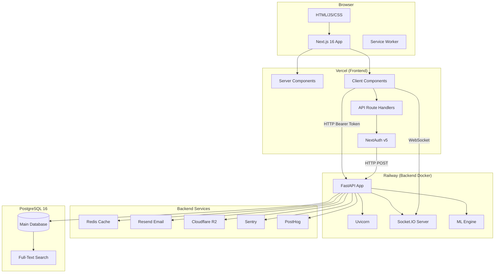
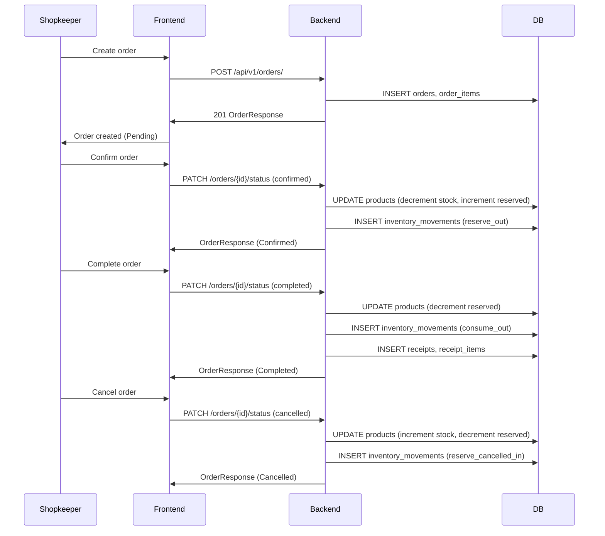
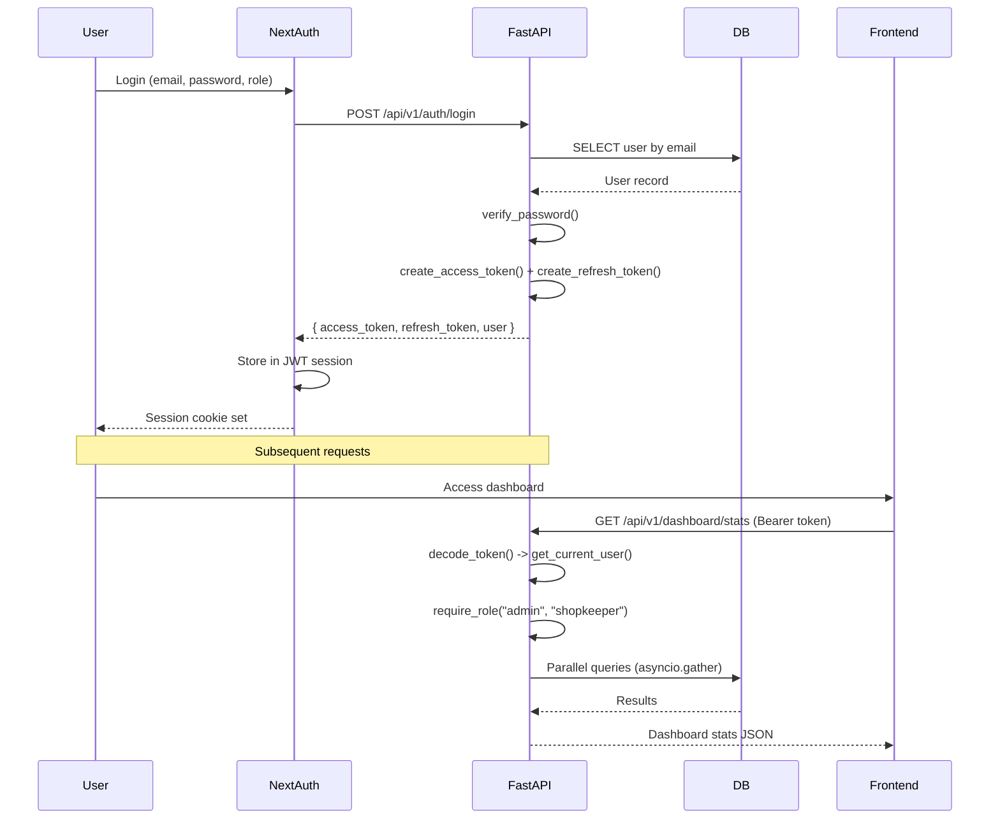
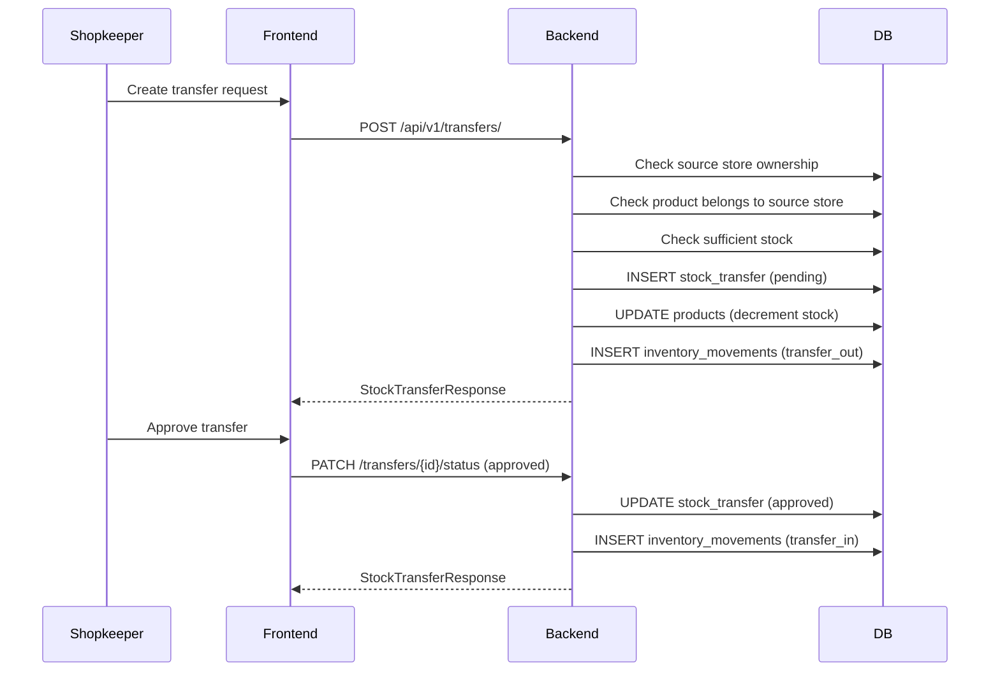

# Architecture

## High-Level Overview

KhataBox follows a modern two-tier architecture: a Next.js 16 frontend (React 19, App Router) communicates with a FastAPI backend over HTTP REST. The backend connects to PostgreSQL for persistent storage, Redis for caching and task queuing, and Cloudflare R2 for file storage. Real-time updates are delivered via Socket.IO.

```
Browser (User)
    |
    | HTTPS
    v
Next.js 16 (Vercel) -----> FastAPI (Railway) -----> PostgreSQL 16
    |                           |                        |
    | SSR/CSR                  | JWT Auth               | TSVECTOR FTS
    | NextAuth v5              | Socket.IO              | GIN Indexes
    | Zustand                  | ML Pipeline            |
    | TanStack Query           | Redis Cache            |
    v                           v                        v
    Static Assets            Cloudflare R2            Redis 7
```

## System Architecture Diagram



## Backend Architecture

### Layers

The backend follows a layered architecture:

```
Request (HTTP)
    |
    v
Middleware (CORS, Rate Limiter, Performance)
    |
    v
Router (api/v1/) -- 22 modules
    |
    v
Dependencies (get_current_user, require_role)
    |
    v
Service Layer (services/) -- Business logic
    |
    v
Model Layer (models/) -- SQLAlchemy ORM
    |
    v
Database (PostgreSQL)
```

### Request Flow

1. HTTP request arrives at FastAPI
2. CORS middleware validates origin
3. Rate limiter middleware checks request count (Redis + in-memory fallback)
4. Performance middleware records response time in `X-Response-Time` header
5. Router matches the endpoint
6. Dependency injection chain:
   - `get_db()` provides async SQLAlchemy session
   - `HTTPBearer` extracts JWT from Authorization header
   - `get_current_user()` decodes JWT and loads User from DB
   - `require_role()` validates user role against allowed roles
7. Route handler executes (typically thin, delegates to service)
8. Service layer executes business logic (queries, transformations)
9. Pydantic models validate response data
10. JSON response returned

### Service Layer

Services in `backend/app/services/`:

| Service | File | Responsibility |
|---------|------|---------------|
| order_service | `services/order_service.py` | Order CRUD, status transitions, reservation |
| cart_service | `services/cart_service.py` | Customer cart CRUD, checkout flow |
| inventory_service | `services/inventory_service.py` | Stock movements, QR scan stock updates |
| cache | `services/cache.py` | Redis get/set/delete/invalidate pattern |
| backup | `services/backup.py` | Full DB backup/restore (JSON + R2) |
| notifications | `services/notifications.py` | Low-stock detection + DB notification creation |
| email | `services/email.py` | Resend transactional emails |
| storage | `services/storage.py` | Cloudflare R2 file operations |
| rate_limiter | `services/rate_limiter.py` | 100 req/min with Redis + fallback |
| socketio_manager | `services/socketio_manager.py` | Socket.IO server, room subscriptions |
| task_queue | `services/task_queue.py` | Redis FIFO task queue |

### Graceful Degradation Pattern

All external services implement an `is_available()` check. When a dependency is unavailable:

- **Redis Cache**: Falls back to no-caching (queries always hit DB)
- **Cloudflare R2**: Returns placeholder URLs for images
- **Resend**: Email notifications silently skipped
- **ML Model**: Falls back to heuristic prediction (historical avg + 10%)
- **Rate Limiter**: Falls back to in-memory counter

### ML Pipeline

Located in `backend/app/ml/`:

- `train.py` generates 2000 synthetic data points and trains a RandomForestRegressor
- The model is saved as `model.pkl` using joblib
- `predict.py` loads the model and exposes `predict_demand()` and `is_model_ready()`
- Features: product_id, category encoded, day_of_week, month, is_holiday
- Output: predicted_demand, recommended_order_qty, confidence_score, seasonality_factor

## Frontend Architecture

### Rendering Strategy

The frontend uses Next.js 16 App Router with a mix of Server Components and Client Components:

- **Server Components**: Dashboard layout, page shells, auth guard (default in App Router)
- **Client Components**: Interactive UI (login form, product table, cart, charts, dialogs)
- **useState/useEffect**: Used on every page for data fetching (TanStack Query provider is installed but not actively used)
- **Streaming**: Server Components can stream content (Suspense boundaries)

### Route Structure

```
Public Routes:
  /                    Landing page (page.tsx)
  /login               Credentials login with role selection
  /register            Shopkeeper/customer registration
  /catalog             Public product catalog
  /scan                QR code scanner
  /customer            Customer landing page

Customer Routes:
  /cart                Shopping cart
  /my-orders           Customer order history
  /receipts/[id]       Receipt view (customer)

Dashboard Routes (admin/shopkeeper, under (dashboard) route group):
  /dashboard           Stats cards, charts
  /dashboard/catalog   B2B customer catalog
  /dashboard/inventory Product management table
  /dashboard/inventory/movements  Stock movement history
  /dashboard/inventory/scan       QR scan stock updates
  /dashboard/orders    Order management
  /dashboard/order-history        Order history
  /dashboard/purchase-orders      Purchase orders
  /dashboard/transfers Stock transfers
  /dashboard/billing   Invoice/billing
  /dashboard/customers B2B customer CRUD
  /dashboard/suppliers Supplier management
  /dashboard/suppliers/price-analysis  Margin analysis
  /dashboard/reports   Sales & customer reports
  /dashboard/forecasting ML forecast visualization
  /dashboard/notifications Alert center
  /dashboard/qr-labels Batch QR label printing
  /dashboard/stores    Multi-store management
  /dashboard/settings  Profile, export
  /dashboard/admin/users Admin user management
```

### Auth Flow (Frontend)

```
1. User visits /login
2. Selects role tab (admin/shopkeeper/customer)
3. Submits email + password
4. signIn("credentials", { email, password, role })
5. NextAuth authorize callback:
   a. POST to http://localhost:8002/api/v1/auth/login
   b. Backend returns { access_token, refresh_token, user }
   c. NextAuth stores tokens in JWT session
6. Session callback adds role and access_token to session
7. Server components use requireAuth() to protect routes
8. Client components use useSession() + RoleGuard
9. API calls via client-api.ts attach Bearer token
10. proxy.ts (server-side) redirects unauthenticated users to /login
```

### Client-Side API Client

`src/lib/client-api.ts` wraps fetch with:

- Automatic Bearer token injection from NextAuth session
- JSON content-type headers
- Methods: get, post, put, patch, del
- Error handling (non-OK responses throw errors)

Server components use `src/lib/api.ts` (same pattern, calls `auth()` for session).

### State Management

- **Zustand**: Cart state (`store/cart.ts`) and active store selection (`lib/store-context.ts`)
- **TanStack Query**: Provider installed in root layout, available for server state caching
- **NextAuth session**: User identity and tokens

## Data Flow Diagrams

### Order Lifecycle Data Flow



### Authentication Data Flow



### Stock Transfer Data Flow



## Component Interaction

### Frontend Component Tree

```
RootLayout
├── Providers (SessionProvider, QueryClientProvider)
│   ├── LandingPage (/)
│   ├── LoginPage (/login)
│   │   └── RoleSelector (admin/shopkeeper/customer tabs)
│   ├── RegisterPage (/register)
│   └── DashboardLayout (/dashboard, /orders, etc.)
│       ├── Sidebar (role-filtered nav, store selector)
│       ├── TopNav (search, notifications bell, user menu)
│       ├── BottomNav (mobile: 5 items + FAB)
│       └── Page Content
│           ├── RoleGuard
│           └── [Page-specific components]
```

### Key Design Decisions

1. **Server-side auth guard**: Dashboard layout calls `requireAuth()` in a Server Component, preventing flash of unauthorized content.

2. **Client-side role guard**: `RoleGuard` component wraps content that should only be visible to certain roles.

3. **Graceful degradation**: All external integrations (Redis, R2, Resend, Sentry, PostHog, ML model) are optional. The app runs fully with just PostgreSQL.

4. **Async database**: SQLAlchemy async engine with `selectinload()` for eager loading of relationships, preventing lazy-load issues.

5. **Concurrent dashboard queries**: Dashboard stats are fetched with `asyncio.gather()` for parallel query execution.

6. **Idempotent seeding**: `seed_india.py` is safe to re-run; it clears existing non-admin data before inserting.
